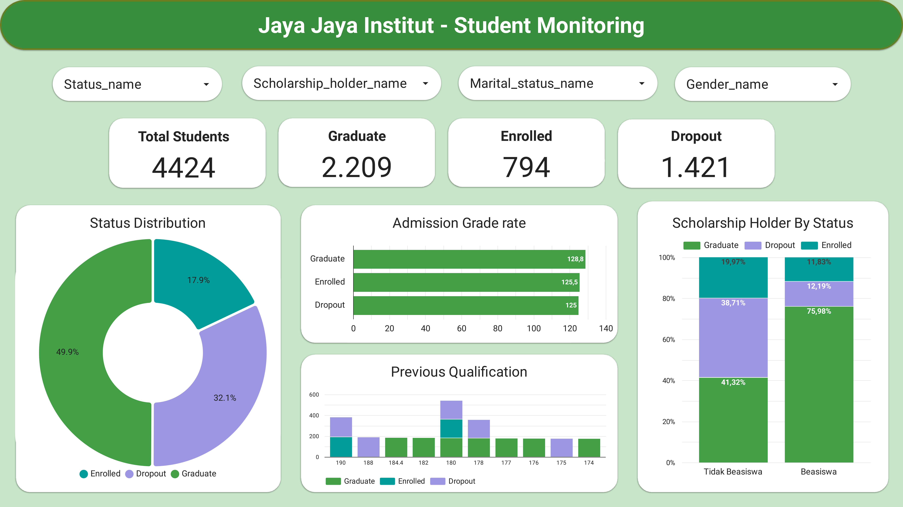
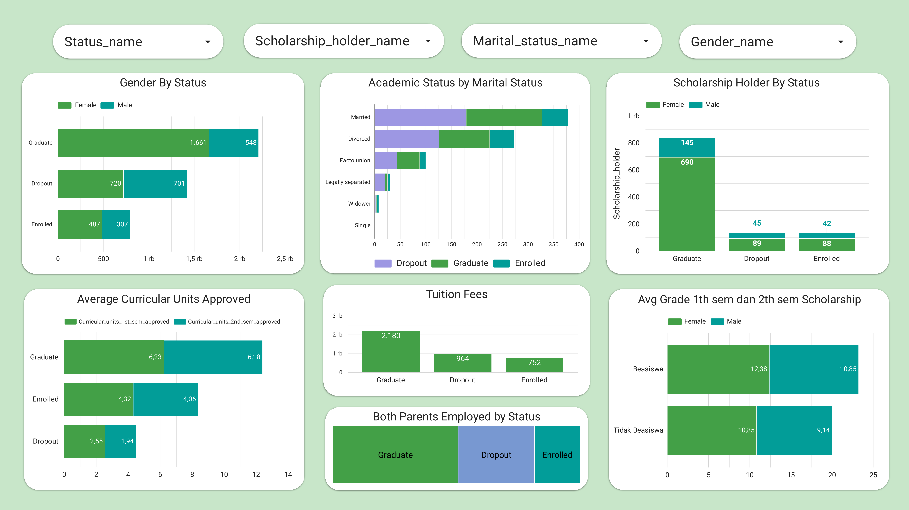
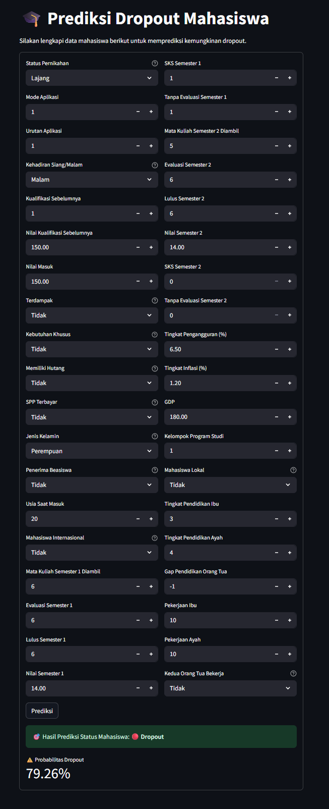

# Proyek Akhir: Menyelesaikan Permasalahan Perusahaan Edutech Jaya Jaya Institut 

## Business Understanding

Jaya Jaya Institut merupakan lembaga pendidikan tinggi berbasis teknologi pendidikan (edutech) yang menghadapi tantangan besar dalam mempertahankan mahasiswa hingga menyelesaikan studinya. Tingkat dropout yang tinggi tidak hanya merusak reputasi institusi, tetapi juga menyebabkan kerugian finansial serta menurunkan efisiensi operasional. Oleh karena itu, institusi ini memerlukan sistem yang dapat memprediksi potensi mahasiswa berhenti kuliah lebih awal, sehingga intervensi tepat waktu dapat dilakukan.

### Permasalahan Bisnis

Jaya Jaya Institut mengalami masalah serius akibat tingginya angka mahasiswa yang berhenti kuliah dari satu semester ke semester berikutnya. Fenomena ini berdampak besar pada reputasi institusi dan keberlangsungan finansial operasional kampus. Sayangnya, hingga kini belum ada sistem prediktif yang mampu mendeteksi mahasiswa dengan risiko dropout tinggi secara dini, sehingga institusi kesulitan melakukan intervensi yang cepat dan sesuai kebutuhan individu.

Selain itu, keputusan strategis manajemen sering kali tidak didasarkan pada data historis yang akurat dan terorganisir. Kurangnya alat analisis yang menyeluruh menyebabkan evaluasi performa akademik dan sosial mahasiswa menjadi kurang efektif. Ditambah lagi, minimnya visualisasi data yang mudah dipahami menyulitkan pengambil kebijakan untuk mengenali pola penting dalam data. Maka dari itu, diperlukan solusi berbasis *machine learning* dan analitik visual untuk menangani tantangan ini secara lebih terstruktur dan efisien.

### Cakupan Proyek

Proyek ini melibatkan beberapa tahapan utama untuk mengatasi masalah dropout mahasiswa di Jaya Jaya Institut, yaitu:

1. **Pemahaman Bisnis**  
   Mengidentifikasi konteks masalah dropout mahasiswa yang memengaruhi kualitas pendidikan dan reputasi institusi, serta kebutuhan akan sistem prediktif untuk mendukung intervensi awal oleh manajemen.

2. **Pemahaman dan Persiapan Data**  
   Melakukan eksplorasi awal pada dataset historis mahasiswa, menangani nilai yang hilang dan data pencilan (*outlier*), serta melakukan transformasi fitur seperti pengkodean (*encoding*) dan rekayasa fitur (*feature engineering*) untuk menyiapkan data yang siap digunakan dalam pemodelan.

3. **Analisis Data Eksploratif (EDA)**  
   Menganalisis distribusi dan pola dropout berdasarkan fitur kunci seperti tingkat pendidikan orang tua, status beasiswa, jenis kelamin, prestasi akademik, dan kondisi ekonomi untuk mendapatkan wawasan yang relevan.

4. **Pemodelan**  
   Mengembangkan beberapa model prediksi dropout, seperti Random Forest, XGBoost, dan Gradient Boosting, lalu membandingkan performanya menggunakan metrik seperti akurasi, F1-score, presisi, dan *recall*.

5. **Evaluasi**  
   Memilih model terbaik berdasarkan hasil evaluasi dan menafsirkan fitur yang paling memengaruhi kemungkinan mahasiswa dropout.

6. **Persiapan Prediksi dan Penyebaran**  
   Menyusun skrip inferensi berbasis Python yang memuat model terbaik dalam format `.pkl`, dengan preprocessing konsisten menggunakan `scaler.pkl` dan `feature_columns.pkl`. Model ini diintegrasikan ke dalam aplikasi berbasis Streamlit yang ramah pengguna, memungkinkan input data mahasiswa (seperti prestasi akademik, status beasiswa, usia saat mendaftar, dan faktor sosial-ekonomi lainnya) melalui antarmuka web. Aplikasi ini telah berhasil disebarkan ke Streamlit Community Cloud, sehingga dapat diakses jarak jauh oleh pemangku kepentingan untuk memprediksi risiko dropout secara langsung.

7. **Pengembangan Dashboard**  
   Membuat dashboard interaktif menggunakan Looker Studio yang terhubung dengan database Supabase. Dashboard ini menampilkan statistik dropout, tren berdasarkan jenis kelamin, beasiswa, nilai masuk, dan metrik akademik lainnya secara real-time.

8. **Rekomendasi**  
   Memberikan saran tindakan berbasis data kepada pihak kampus, seperti memperkuat program beasiswa, meningkatkan sistem pemantauan akademik, dan melaksanakan intervensi sosial untuk kelompok mahasiswa berisiko tinggi.

## Persiapan

### Sumber Data
Dataset bersumber dari data internal mahasiswa Jaya Jaya Institut, mencakup informasi demografi, akademik, dan kondisi sosial-ekonomi.

Dataset dapat diakses melalui tautan berikut:  
[](https://github.com/dicodingacademy/dicoding_dataset/tree/main/students_performance)

### Penyiapan Lingkungan

Untuk menyiapkan lingkungan yang diperlukan guna menjalankan aplikasi dan model prediksi dropout, ikuti langkah-langkah berikut:

1. **Membuat lingkungan baru dengan Conda**  
   Jalankan perintah berikut untuk membuat lingkungan baru bernama `dropout-env` menggunakan Python 3.11.8:  
   ```
   conda create -n dropout-env python=3.11.8
   ```

2. **Mengaktifkan lingkungan**  
   Setelah lingkungan dibuat, aktifkan dengan perintah berikut:  
   ```
   conda activate dropout-env
   ```

3. **Menginstal dependensi**  
   Setelah lingkungan aktif, instal semua dependensi yang diperlukan menggunakan file `requirements.txt` yang tersedia dalam proyek ini:  
   ```
   pip install -r requirements.txt
   ```

### Struktur Direktori

```
📂 Student_Dropout_Detection_BPDS2           # Folder utama proyek deteksi mahasiswa dropout
│   README.md                                   # Dokumentasi proyek
│   predict.py                                  # Script sederhana untuk prediksi dropout menggunakan model terbaik
│   notebook.ipynb                              # Notebook eksplorasi dan pelatihan model
│   app.py                                      # Prototipe sistem prediksi dropout,  berbasis Streamlit 
│   johanadisantoso-dashboard-1.png             # Gambar dashboard visualisasi (Halaman 1)
│   johanadisantoso-dashboard-2.png             # Gambar dashboard visualisasi (Halaman 2)
│   johanadisantoso-dashboard-streamlit.png     # Tampilan Prototipe dalam aplikasi Streamlit
│   johanadisantoso-video.mp4                   # Video singkat berisi penjelasan dashboard dan kesimpulan
│   requirements.txt                            # Daftar dependensi Python untuk menjalankan proyek
│
├── model                                     # Folder berisi model dan alat bantu untuk prediksi
│   ├── best_model_randomforest.pkl             # File model Random Forest terbaik 
│   ├── feature_columns.pkl                     # File pickle untuk daftar fitur yang digunakan
│   └── scaler.pkl                              # Objek scaler untuk normalisasi data
│
└── dataset                                   # Folder berisi dataset
    ├── data.csv                                # Dataset utama
    └── education_data_sb.csv                   # Dataset final hasil tahap akhir di notebook

```

## Business Dashboard

Dashboard interaktif dibuat menggunakan Looker Studio untuk membantu manajemen memantau tren dropout dan menganalisis faktor penting seperti usia, latar belakang pendidikan, status pembayaran, dan lainnya.

Dashboard dapat diakses melalui tautan berikut:  
[](https://lookerstudio.google.com/reporting/e8820daf-4f49-4f3b-b6a6-3a593ba93f1d)






## Menjalankan Sistem Machine Learning
Prototipe sistem prediksi dropout dikembangkan menggunakan Streamlit, memungkinkan pengguna memasukkan data mahasiswa dan mendapatkan prediksi secara real-time.

🔗 Prototipe sistem prediksi dropout: (https://student-dropout-predictions-bpds2.streamlit.app/)

Setelah makakukan Penyiapan Lingkungan, Langkah selanjutnya untuk menjalankan Prototipe secara lokal dengan perintah berikut: 
```
streamlit run app.py
```
Berikut gambar screenshot prototipe sistem prediksi dropout:




## Conclusion

Berbagai model klasifikasi diuji untuk mengukur kemampuan prediksi, dengan hasil akurasi sebagai berikut: Logistic Regression (87,34 %), SVM (86,44 %), GradBoost (86,55 %), RandomForest (87,57 %), XGBoost (87,34 %), LightGBM (87,46 %), dan CatBoost (87,01 %). Dari semua opsi tersebut, **RandomForest** menonjol sebagai yang paling andal dalam mengenali mahasiswa berisiko dropout, RandomForest memiliki akurasi tertinggi sekaligus relatif mudah diinterpretasi. Selain keunggulan model, Dashboard menunjukkan bahwa tingkat dropout di Jaya Jaya Institut mencapai 32.1% (1,421 dari 4,424 mahasiswa), yang merupakan masalah signifikan. Faktor utama yang berkontribusi meliputi tantangan finansial, beasiswa, kesulitan akademik,  keadaan pribadi atau status pernikahan dan performa akademik di awal perkuliahan, seperti jumlah mata kuliah yang disetujui / nilai semester awal. Prototipe sistem prediksi dropout yang dikembangkan juga menawarkan wawasan untuk mendukung pengambilan keputusan, sehingga institusi dapat segera mengambil langkah preventif dan strategis.


### Rekomendasi Action Items

Berdasarkan data dan temuan dari dashboard "Pemantauan Dropout Mahasiswa Jaya Jaya Institut," berikut adalah langkah-langkah strategis yang disarankan untuk mengurangi angka dropout dan meningkatkan retensi mahasiswa di Jaya Jaya Institut. Rekomendasi ini dirancang berdasarkan analisis metrik utama seperti status beasiswa, performa akademik, status pernikahan, dan faktor lain yang memengaruhi retensi mahasiswa.


### **Rekomendasi Action Items**

#### 1. **Perluas Program Beasiswa**
- **Tindakan**: Tingkatkan jumlah beasiswa yang tersedia, terutama untuk mahasiswa dengan nilai kualifikasi sebelumnya yang rendah (174–178) dan mahasiswa dari latar belakang ekonomi rendah.
- **Rasional**: Data menunjukkan bahwa mahasiswa pemegang beasiswa memiliki tingkat dropout yang jauh lebih rendah (12.19%) dibandingkan non-pemegang beasiswa (38.71%). Beasiswa terbukti meningkatkan peluang kelulusan (75.98% untuk pemegang beasiswa vs. 41.32% untuk non-pemegang beasiswa).
- **Implementasi**: Bermitra dengan organisasi eksternal, alumni, atau program pemerintah untuk mendanai lebih banyak beasiswa. Prioritaskan mahasiswa berisiko tinggi berdasarkan data finansial dan akademik.
- **Dampak yang Diharapkan**: Mengurangi tekanan finansial yang menjadi salah satu penyebab utama dropout, sehingga meningkatkan retensi dan kelulusan.

#### 2. **Terapkan Program Dukungan Akademik Terarah**
- **Tindakan**: Sediakan dukungan akademik bagi mahasiswa dengan nilai masuk rendah (sekitar 125) dan yang kesulitan menyelesaikan unit kurikuler (misalnya, rata-rata dropout hanya 2.55 unit di semester 1).
- **Rasional**: Mahasiswa yang dropout memiliki performa akademik lebih rendah, dengan rata-rata unit kurikuler yang disetujui jauh di bawah mahasiswa lulus (6.23 unit di semester 1). Intervensi dini dapat membantu mereka tetap bertahan.
- **Implementasi**: Tawarkan kelas remedial, bimbingan belajar, dan mentoring oleh rekan sebaya. Identifikasi mahasiswa berisiko sejak awal melalui pemantauan performa akademik.
- **Dampak yang Diharapkan**: Peningkatan kemampuan akademik mahasiswa berisiko, mengurangi kemungkinan mereka meninggalkan studi.

#### 3. **Perkuat Layanan Dukungan Mahasiswa**
- **Tindakan**: Dirikan pusat keberhasilan mahasiswa yang menawarkan konseling, bimbingan karier, dan dukungan kesehatan mental.
- **Rasional**: Dropout sering kali dipengaruhi oleh tantangan non-akademik seperti masalah emosional atau pribadi. Dukungan yang tepat dapat mengatasi hambatan ini.
- **Implementasi**: Rekrut konselor tambahan dan penasihat akademik untuk memberikan dukungan personal kepada mahasiswa, terutama yang berisiko tinggi.
- **Dampak yang Diharapkan**: Mahasiswa merasa lebih didukung dan terhubung dengan institusi, mengurangi tingkat dropout akibat faktor non-akademik.

#### 4. **Kembangkan Sistem Peringatan Dini**
- **Tindakan**: Gunakan analitik data untuk mengidentifikasi mahasiswa berisiko dropout berdasarkan performa akademik, kehadiran, dan keterlibatan.
- **Rasional**: Identifikasi dini memungkinkan intervensi sebelum mahasiswa memutuskan untuk keluar. Data menunjukkan indikator seperti nilai rendah dan sedikit unit kurikuler sebagai tanda risiko.
- **Implementasi**: Lacak indikator utama seperti absensi atau nilai rendah, lalu tetapkan mentor atau penasihat untuk melakukan intervensi.
- **Dampak yang Diharapkan**: Penanganan proaktif terhadap mahasiswa berisiko akan meningkatkan retensi dan mencegah dropout.

#### 5. **Tingkatkan Keterlibatan dan Pembangunan Komunitas**
- **Tindakan**: Tingkatkan keterlibatan mahasiswa melalui aktivitas ekstrakurikuler, klub, dan acara untuk membangun rasa memiliki terhadap institusi.
- **Rasional**: Mahasiswa yang merasa terhubung dengan kampus cenderung lebih bertahan. Data menunjukkan mahasiswa yang terdaftar (17.9%) mungkin kurang motivasi atau koneksi.
- **Implementasi**: Adakan acara sosial dan akademik secara rutin, serta dorong partisipasi dalam organisasi mahasiswa.
- **Dampak yang Diharapkan**: Rasa kebersamaan yang lebih kuat akan meningkatkan kepuasan mahasiswa dan mengurangi dropout.

#### 6. **Berikan Dukungan untuk Mahasiswa yang Menikah dan Bercerai**
- **Tindakan**: Tawarkan jadwal fleksibel, dukungan penitipan anak, dan konseling untuk mahasiswa yang menikah atau bercerai.
- **Rasional**: Mahasiswa dengan status pernikahan ini memiliki tingkat dropout yang lebih tinggi (~50 untuk menikah, ~20 untuk bercerai) karena tanggung jawab pribadi.
- **Implementasi**: Ciptakan program dukungan khusus untuk membantu mereka menyeimbangkan komitmen akademik dan pribadi.
- **Dampak yang Diharapkan**: Mengurangi dropout di kalangan mahasiswa dengan tanggung jawab keluarga, meningkatkan kelulusan mereka.

#### 7. **Pantau dan Evaluasi Kemajuan**
- **Tindakan**: Pantau efektivitas intervensi secara berkelanjutan menggunakan dashboard dan sesuaikan strategi sesuai kebutuhan.
- **Rasional**: Pengambilan keputusan berbasis data memastikan sumber daya digunakan secara efisien untuk mengatasi masalah dropout.
- **Implementasi**: Tetapkan target spesifik (misalnya, kurangi tingkat dropout di bawah 20% dalam dua tahun) dan tinjau kemajuan secara berkala.
- **Dampak yang Diharapkan**: Strategi yang terus diperbarui akan memastikan hasil yang optimal dalam meningkatkan retensi mahasiswa.

